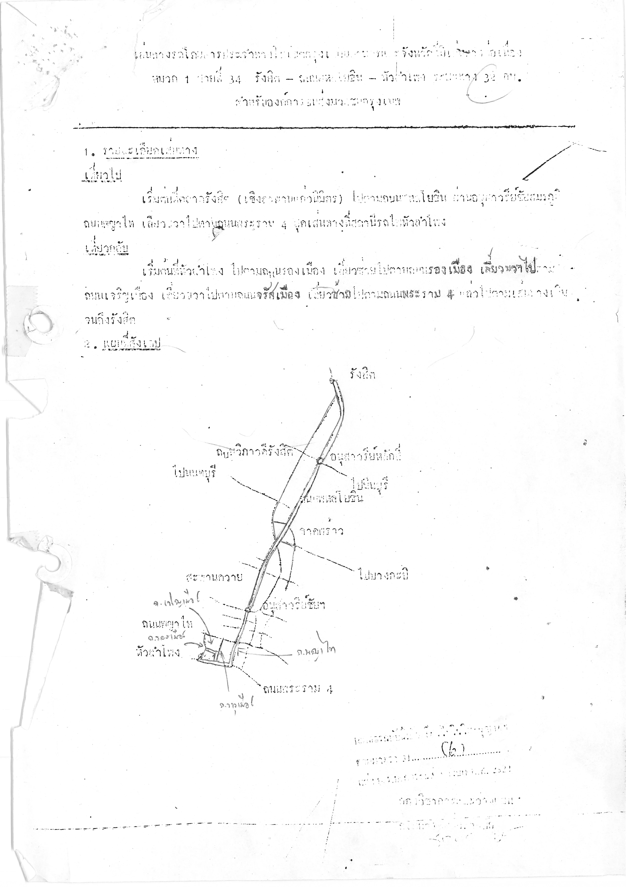

# 34bench

A benchmark: can a model read this scanned document for Bangkok bus route 34, and transcribe it?

The whole design discussion, with every decision, is in
[issue #1](https://github.com/dtinth/34bench/issues/1).



Image derived from
[Bangkok Metropolitan Administration open data](https://data.bangkok.go.th/dataset/route1/resource/fe46b39e-d99f-4eb4-b5a9-dc43606f7eb1),
GFDL 1.3. See [data/route34](data/route34/).

## Results


The results table is a derivative of the document (it contains crops, the ground truth, and model
transcriptions), so it is also under the GFDL 1.3. See [data/COPYING](data/COPYING).

## Method

- Each model gets [`route34.png`](data/route34/route34.png) and this prompt (see
  [`src/run.ts`](src/run.ts)): "Transcribe this image into a Markdown document. Output only the
  Markdown, with no commentary. For each figure, write an HTML `<figure>` element with a description
  of the figure inside it." OCR services (Paxa, iApp, Mistral, AksonOCR) get only the image. Typhoon
  OCR gets its own prompt and image size, as its official client sends them (see
  [`src/typhoon.ts`](src/typhoon.ts)).
- From each response, the header, forward trip, return trip, and footer are extracted into
  `extracted.json`. The map (section 2) is not scored. See
  [`results/README.md`](results/README.md#extraction-rules).
- The score is the accuracy. For each of the 4 parts, the character error rate (CER) is the edit
  distance divided by the length of the [ground truth](data/route34/ground-truth.json) part, and the
  part's accuracy is `max(0, 1 − CER)`. The score is the average of the 4 part accuracies, with the
  length of each part as its weight. So a part costs at most its own weight: a long made-up footer
  does not reduce the score of the other parts. The unit is a grapheme cluster (`Intl.Segmenter`),
  so a Thai mark counts with its base character. Before scoring, markup is removed, all dashes are
  the same, dot leaders are removed, and whitespace is ignored. Thai and Arabic digits are the same.
- Each model runs with its default reasoning effort. Each configuration has 5 runs. The table shows
  the accuracy of the median run, and of the best and the worst run.
- Prices are in THB: 1 USD = 35 THB; Paxa: 329 THB per 10,000 credits; iApp: 1.25 THB per IC (list
  prices).

## Commands

```sh
deno task run --model google/gemini-3.8-flash --runs 3                # OpenRouter
deno task paxa --runs 3                                              # Paxa Labs OCR
deno task iapp --runs 3                                              # iApp OCR
deno task typhoon --runs 3                                           # Typhoon OCR
deno task mistral --model mistral-ocr-2512 --runs 3                  # Mistral OCR 3
deno task mistral --model mistral-ocr-4-0 --runs 3                   # Mistral OCR 4
deno task mistral --model mistral-ocr-4-1 --runs 3                   # Mistral OCR 4.1
deno task akson --runs 3                                             # AksonOCR 1.5 (free)
deno task test                                                       # check extracted.json
deno run --allow-read src/score.ts                                   # print scores
deno task render                                                     # write results.svg
```

Remarks for the table are in [`results/remarks.json`](results/remarks.json). The table uses the
[Sarabun](fonts/) font, embedded in the SVG.

API keys are read from `.env`: `OPENROUTER_API_KEY`, `PAXA_API_KEY`, `IAPP_API_KEY`,
`TYPHOON_API_KEY`, `MISTRAL_API_KEY`, `AKSONOCR_API_KEY`.
